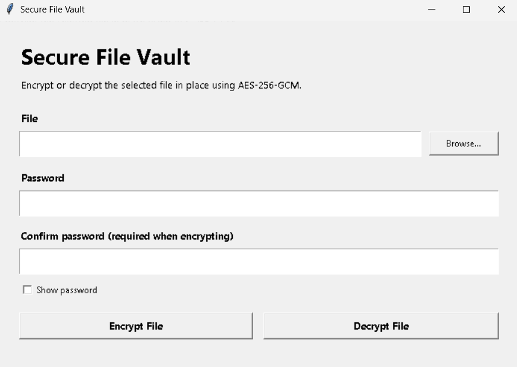

# SecureFileVault
A lightweight Python desktop app for secure password-based file encryption and decryption using AES-256-GCM.

# SecureFileVault

SecureFilevault is a lightweight Python desktop application for password-based file encryption and decryption using AES-256-GCM.

It allows you to select a file, enter a password, and encrypt or decrypt the same file through a simple desktop interface.



## Features

* Simple desktop GUI built with Python
* AES-256-GCM encryption
* Password-based encryption and decryption
* File picker for selecting files
* Encrypts the selected file directly
* Detects incorrect passwords
* Protects against modified or corrupted encrypted files
* Can be converted into a Windows `.exe`

## Requirements

* Python 3.10 or newer
* Windows 10 or Windows 11 recommended

Install the required Python package using:

```bash
pip install cryptography
```

Or use:

```bash
pip install -r requirements.txt
```

## How to Run

Clone the repository:

```bash
git clone https://github.com/YOUR_USERNAME/CipherVault.git
```

Move into the project folder:

```bash
cd CipherVault
```

Install dependencies:

```bash
pip install -r requirements.txt
```

Run the application:

```bash
python secure_file_vault.py
```

## How to Encrypt a File

1. Open CipherVault.
2. Click **Browse**.
3. Select the file you want to encrypt.
4. Enter a password.
5. Confirm the password.
6. Click **Encrypt File**.
7. The selected file will be encrypted.

Example:

```text
Before encryption:

secret.txt
```

After encryption, the contents of `secret.txt` will no longer be readable normally.

## How to Decrypt a File

1. Open CipherVault.
2. Click **Browse**.
3. Select the encrypted file.
4. Enter the same password that was used during encryption.
5. Click **Decrypt File**.
6. The original file contents will be restored.

If an incorrect password is entered, CipherVault will reject the decryption attempt.

## Build a Windows EXE

The repository includes:

```text
build_windows_exe.bat
```

Double-click this file on Windows.

Alternatively, install PyInstaller manually:

```bash
pip install pyinstaller
```

Then run:

```bash
pyinstaller --onefile --windowed --name CipherVault secure_file_vault.py
```

After the build completes, the executable will be available inside:

```text
dist/
```

Example:

```text
dist/CipherVault.exe
```

You can run this `.exe` without opening the Python script manually.

## Project Structure

```text
CipherVault/
│
├── secure_file_vault.py
├── requirements.txt
├── build_windows_exe.bat
├── README.md
└── .gitignore
```

## Security

CipherVault uses AES-256-GCM encryption with a password-derived encryption key.

Important:

* Keep your password safe.
* CipherVault does not store your password.
* There is no password recovery option.
* Losing your password may make the encrypted file permanently inaccessible.
* Always keep important files backed up before experimenting with encryption software.

## Disclaimer

This project is intended for educational and personal file-protection purposes.

Always test the application on copies of important files before relying on it for critical data.

## Technologies Used

* Python
* Tkinter
* Cryptography
* AES-256-GCM
* PyInstaller

## Author

Viraj Jadhav

## License

This project can be released under the MIT License.
